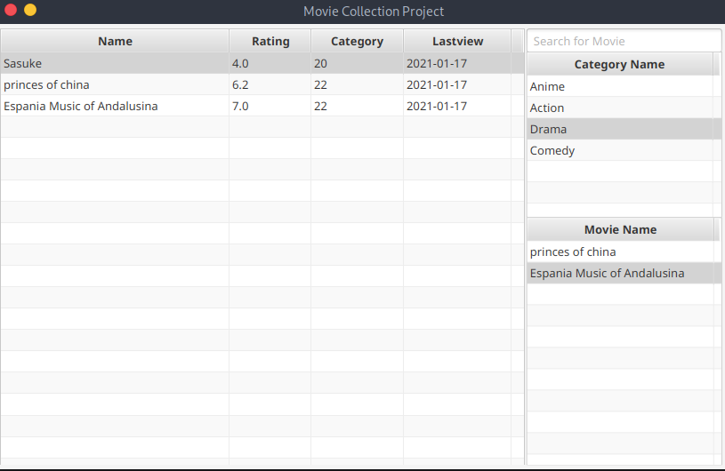
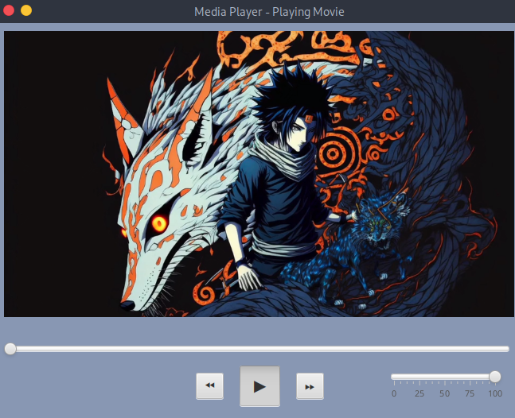

# Movie Collection Project

Movie Collection Project is a desktop movie library and player built with JavaFX, Maven, and Microsoft SQL Server. The application lets users manage a personal movie catalog, organize movies by category, search the collection, and launch a built-in video player for local movie files stored in the project resources.

## Project Overview

This project combines two main workflows in one desktop application:

- Movie collection management
- Local movie playback

Users can:

- View all movies in a table
- Create, edit, and delete movies
- Create, edit, and delete categories
- Filter movies and categories with the search field
- See movies that belong to a selected category
- Play selected video files in an embedded media player
- Get a reminder to clean up old low-rated movies that have not been watched for more than 2 years

## Screenshots

### Main Window



### Movie Player



## Tech Stack

- Java 23
- JavaFX 17
- Maven
- Microsoft SQL Server
- FXML for UI layout

## How The Project Works

The application follows a layered structure:

- `BE`: business entities such as `Movie` and `Category`
- `BLL`: business logic for movie and category operations
- `DAL`: database access for SQL Server
- `GUI`: JavaFX controllers, models, and views

The main window shows:

- A movie table with name, rating, category, and last viewed date
- A category table
- A table that lists movies inside the selected category
- Controls for add, edit, delete, search, and play actions

When a movie is played, the media player window supports:

- Play and pause
- Skip forward 10 seconds
- Skip backward 10 seconds
- Volume control
- Timeline slider for seeking

## Database

The project uses SQL Server through the `mssql-jdbc` driver. The connection is currently configured directly in [`src/main/java/dk/easv/moviecollectionproject/DAL/DBConnector.java`](/home/baron/Desktop/Easv/githup/PMCProject/src/main/java/dk/easv/moviecollectionproject/DAL/DBConnector.java).

Current setup expects:

- Server: `EASV-DB4`
- Database: `PMCDatabase`
- Port: `1433`

Because these values are hardcoded in the source, you will need access to that SQL Server instance or update the connection settings before running the app in another environment.

## Running The Project

### Prerequisites

- JDK 23 installed
- Maven available, or use the included Maven wrapper
- Access to the configured SQL Server database

### Start the application

```bash
./mvnw javafx:run
```

On Windows:

```bash
mvnw.cmd javafx:run
```

## Project Structure

```text
src/main/java/dk/easv/moviecollectionproject
├── BE
├── BLL
├── DAL
└── GUI
    ├── Controller
    ├── Model
    └── View

src/main/resources
├── dk/easv/moviecollectionproject/GUI/View
└── movies
```

## Notes

- Sample movie files are included in `src/main/resources/movies`.
- New movie files selected through the UI are copied into the resources movie folder.
- The application window is fixed-size and opens a separate window for playback.

